<!-- ═══════════════════════════════════════════════════════════════
     Dibyasachi Mohanty · GitHub Profile README
     Repo: Dibyasachi1/Dibyasachi1  ·  Assets live in /assets
═══════════════════════════════════════════════════════════════ -->

  

## 🧑‍💻 About Me

## 🛠️ Tech Stack

**Frontend**

**Backend & Databases**

**Mobile · DevOps · Tools**

## 📊 GitHub Analytics

  

  

## 🚀 Featured Projects

| Project | Description | Stack |
|---|---|---|
| 💳 **[Paygate](https://dibyasachimohanty.vercel.app/projects/paygate)** | UPI payment gateway & merchant management platform — settlements, onboarding, and full transaction lifecycle dashboards | `React 19` `Vite` `Node.js` `Express 5` `Tailwind 4` |
| 🧠 **[Ama-Mana](https://amamana.in)** | Mental health therapy & wellness platform connecting students, therapists, and institutions · **live at amamana.in** | `React 19` `React Native` `TypeScript` `Django 6` |
| 🏢 **[Company CRM](https://dibyasachimohanty.vercel.app/projects/company-crm)** | Internal operations portal — leads, clients, tasks, follow-ups, and role-based team management | `React` `TypeScript` `Node.js` `Express` |
| 🛒 **[SS Labs Shop](https://dibyasachimohanty.vercel.app/projects/ss-labs-shop)** | Full-featured e-commerce storefront with catalog, cart, wishlist & checkout across 6 categories | `HTML5` `CSS3` `JavaScript` |

**➕ 50+ more projects delivered for clients across web, e-commerce, and SaaS →** [**view all case studies**](https://dibyasachimohanty.vercel.app/#projects)

## 🏆 GitHub Trophies

## 🤝 Let's Connect

💼 Open to **freelance projects & consulting** · ⚡ Response time **< 24 hours** · 🌏 **IST (GMT+5:30)**

 

  

