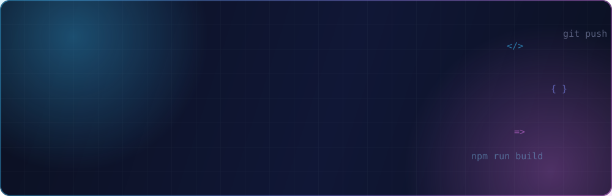
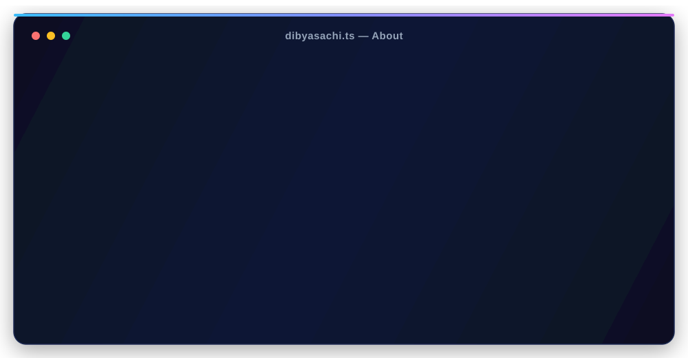
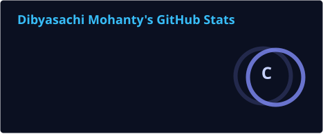
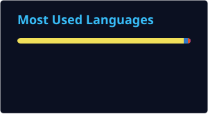
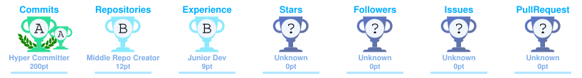

<!-- ═══════════════════════════════════════════════════════════════
     Dibyasachi Mohanty · GitHub Profile README
     Repo: Dibyasachi1/Dibyasachi1  ·  Assets live in /assets
     Palette: #0B1021 #38BDF8 #818CF8 #E879F9 #34D399 #C7D2FE
═══════════════════════════════════════════════════════════════ -->

 

 

  

<table>
  <tr>
    <td align="center" width="25%"><b>50+</b> PRODUCTS SHIPPED</td>
    <td align="center" width="25%"><b>&lt; 24h</b> RESPONSE TIME</td>
    <td align="center" width="25%"><b>IST</b> GMT +5:30</td>
    <td align="center" width="25%"><b>Open</b> FOR FREELANCE</td>
  </tr>
</table>

## 🧑‍💻 About Me

I'm a full stack developer who builds production web apps end to end — from database schema and API design through to the interface people actually click on. Most of my work lives in **React, Next.js, TypeScript, Node and Django**, backed by **PostgreSQL** and **MongoDB**.

- 🏢 &nbsp;Full Stack Developer at **Ultraconic Technologies**
- 🔭 &nbsp;Currently building **Paygate**, a UPI payment gateway, and **[Ama-Mana](https://amamana.in)**, a mental health platform now live
- 🧩 &nbsp;I like the messy parts: payments, auth, role-based access, and dashboards that hold real data
- 💬 &nbsp;Ask me about **React architecture, REST/GraphQL API design, or shipping a product solo**
- 📫 &nbsp;Reach me at **dibyasachimohanty05@gmail.com**

## 🛠️ Tech Stack

<table>
  <tr>
    <td align="right"><b>&nbsp;Frontend&nbsp;</b></td>
    <td></td>
  </tr>
  <tr>
    <td align="right"><b>&nbsp;Backend&nbsp;</b></td>
    <td></td>
  </tr>
  <tr>
    <td align="right"><b>&nbsp;Data&nbsp;</b></td>
    <td></td>
  </tr>
  <tr>
    <td align="right"><b>&nbsp;DevOps &amp; Tools&nbsp;</b></td>
    <td></td>
  </tr>
</table>

## 🚀 Featured Projects

<table>
<tr>
<td width="50%" valign="top">

<h3 align="center">💳 Paygate</h3>

UPI PAYMENT GATEWAY &amp; MERCHANT PLATFORM

Settlements, merchant onboarding and full transaction-lifecycle dashboards — built to handle real money movement.

<a href="https://dibyasachimohanty.vercel.app/projects/paygate"><b>Read the case study →</b></a>

</td>
<td width="50%" valign="top">

<h3 align="center">🧠 Ama-Mana</h3>

MENTAL HEALTH &amp; WELLNESS PLATFORM

Connects students, therapists and institutions across web and mobile. <b>Live at <a href="https://amamana.in">amamana.in</a>.</b>

<a href="https://amamana.in"><b>Visit the live site →</b></a>

</td>
</tr>
<tr>
<td width="50%" valign="top">

<h3 align="center">🏢 Company CRM</h3>

INTERNAL OPERATIONS PORTAL

Leads, clients, tasks and follow-ups in one place, with role-based access for every team.

<a href="https://dibyasachimohanty.vercel.app/projects/company-crm"><b>Read the case study →</b></a>

</td>
<td width="50%" valign="top">

<h3 align="center">🛒 SS Labs Shop</h3>

E-COMMERCE STOREFRONT

Catalog, cart, wishlist and checkout across six categories — no framework, just fundamentals.

<a href="https://dibyasachimohanty.vercel.app/projects/ss-labs-shop"><b>Read the case study →</b></a>

</td>
</tr>
</table>

## 📊 GitHub Analytics

&nbsp;&nbsp;

  

  

 

## 🤝 Let's Build Something

Got a product that needs building — or one that needs rescuing? I take on freelance projects and consulting work, and I reply within a day.

  

⭐ If anything here was useful, a star costs nothing and means a lot.

